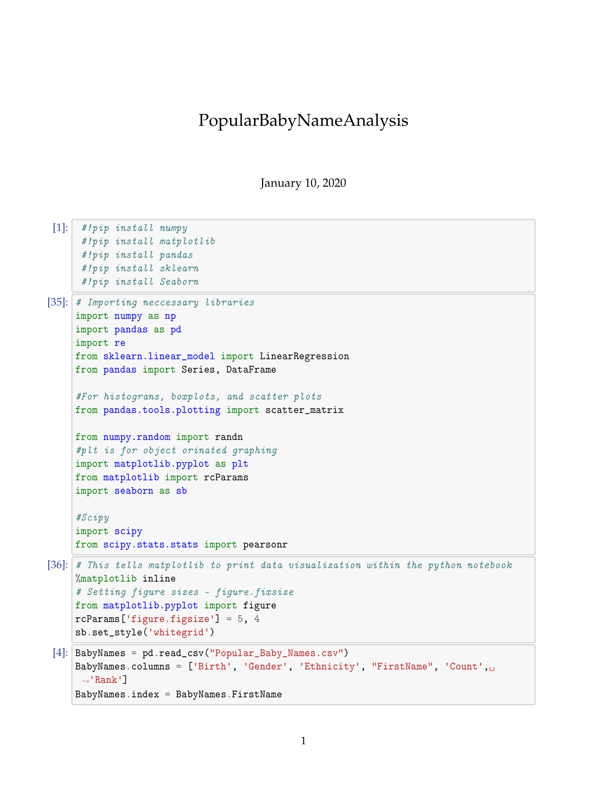
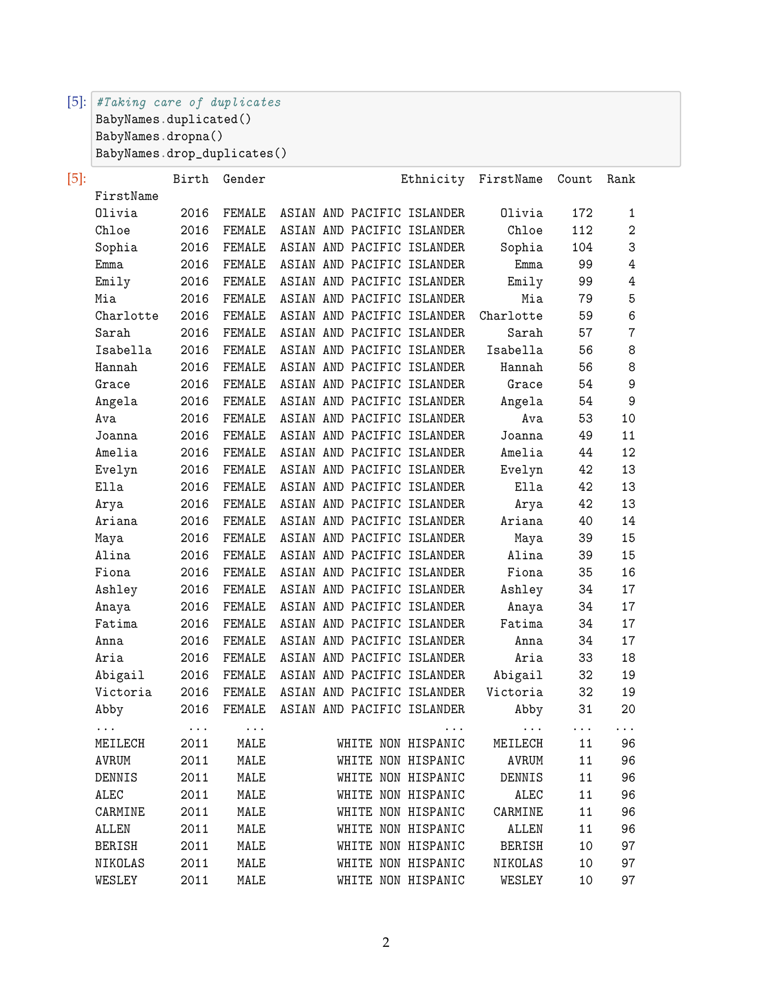
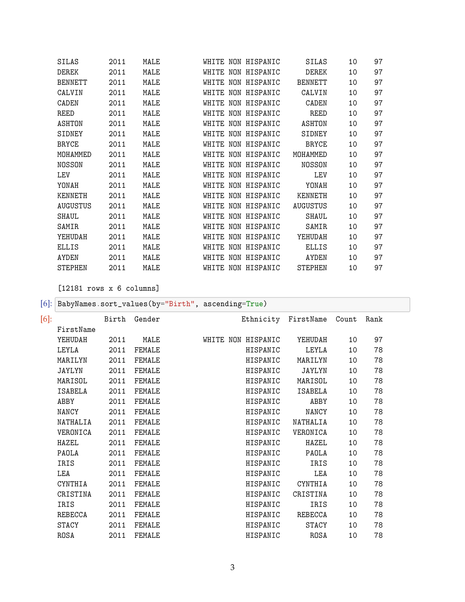
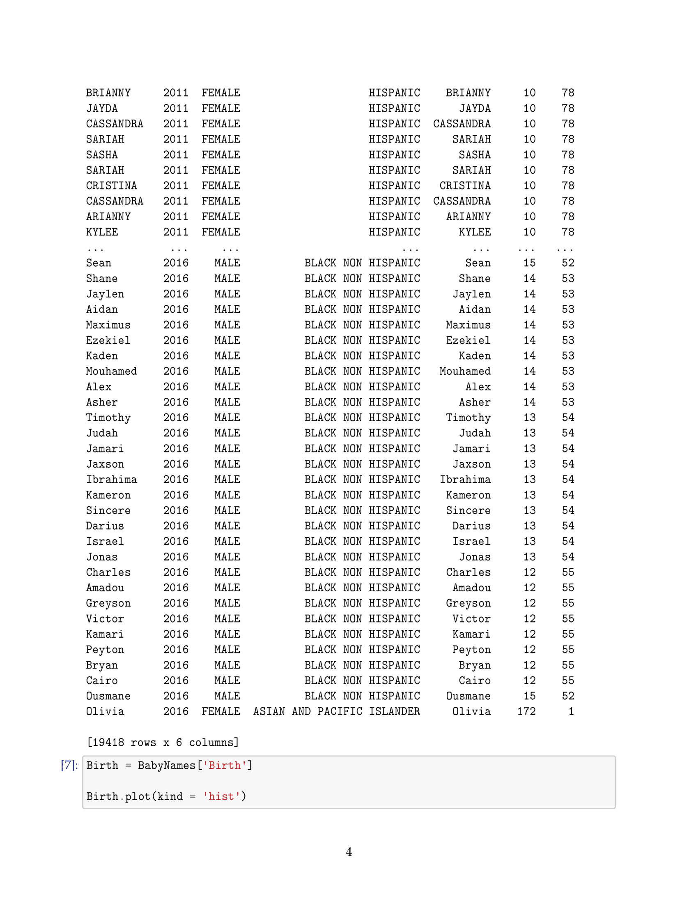
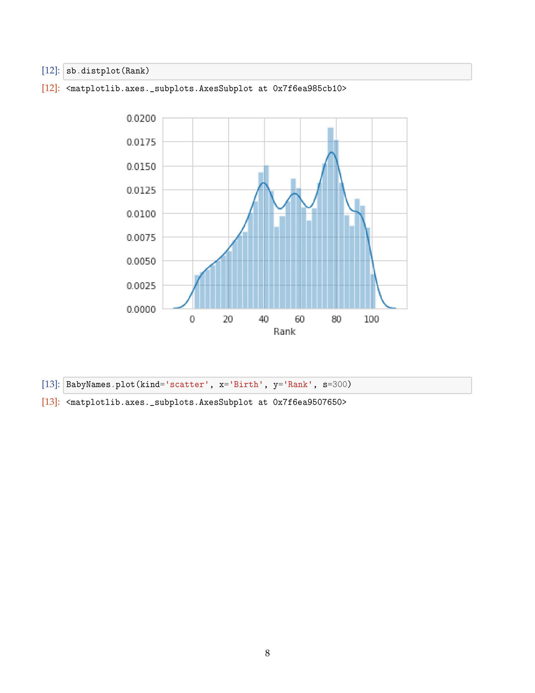
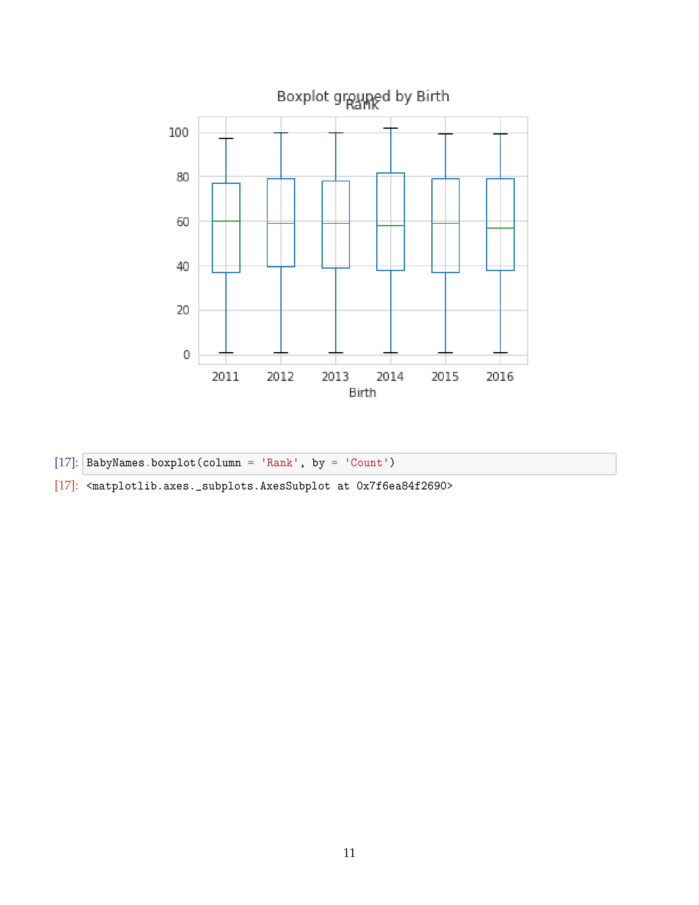
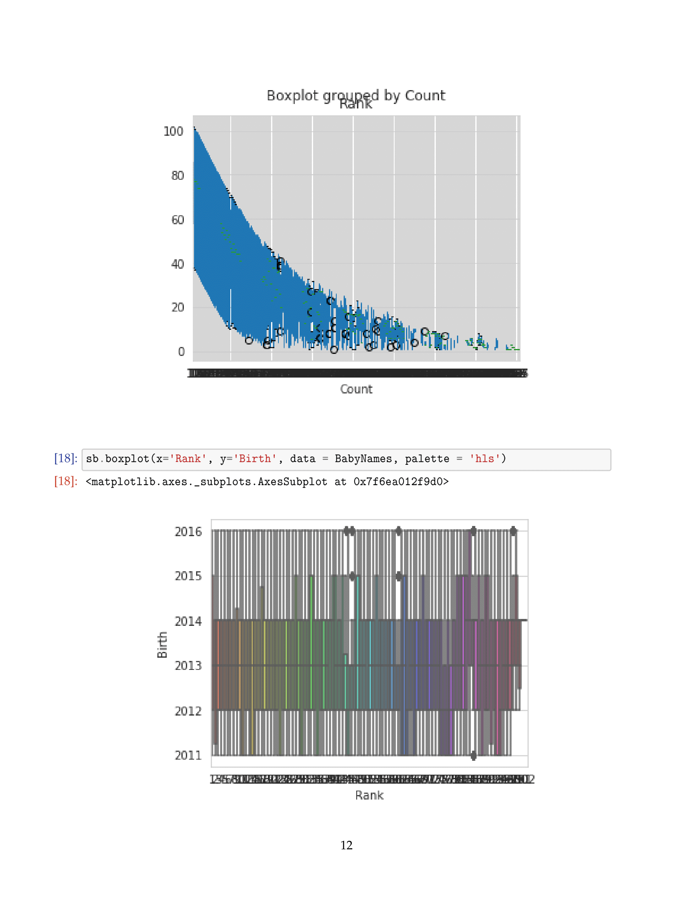
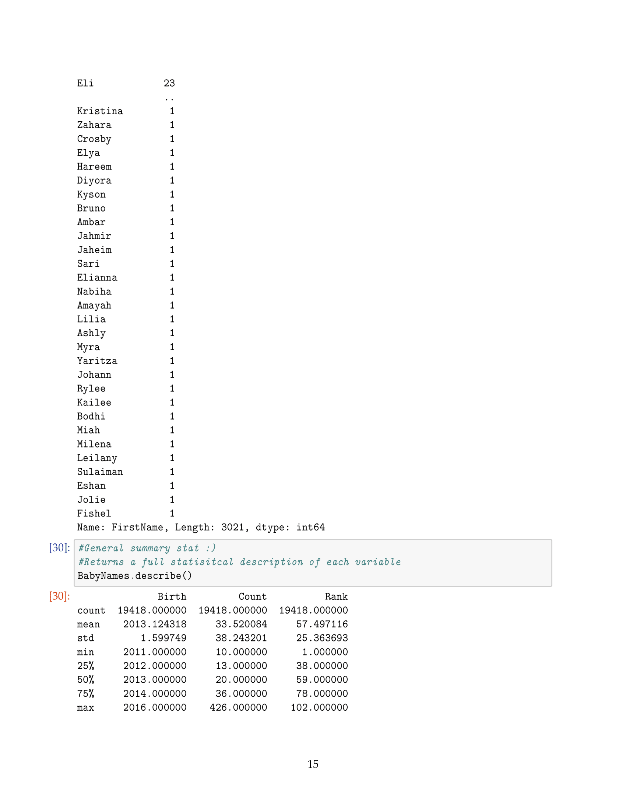

# Popular-Baby-Name-Analysis

This project is an analysiation of popular baby names of 2011-2016 for New York Births done in python.

[Hello](img/PopularBabyNameAnalysis-07.png)

#### Sources:

Data.Gov: [**data set**](https://catalog.data.gov/dataset/most-popular-baby-names-by-sex-and-mothers-ethnic-group-new-york-city-8c742/resource/db4168b5-dbec-4b71-8c80-17b5ab4350e8)

